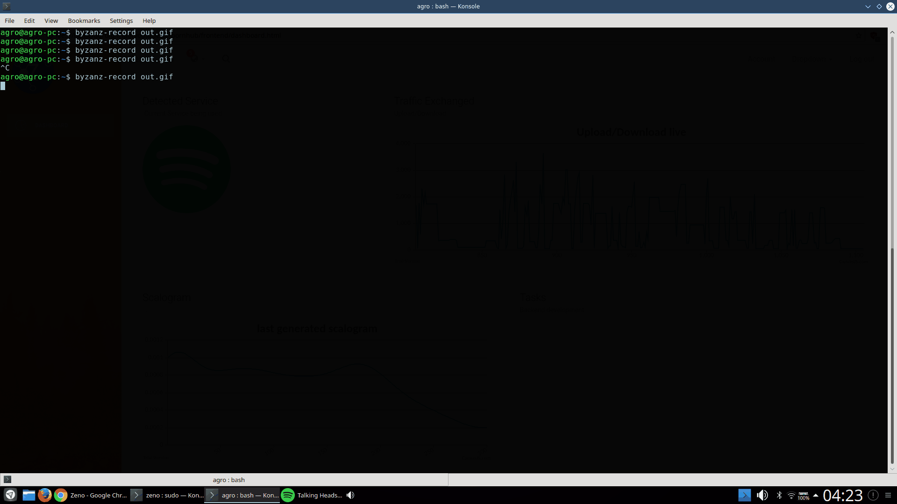

# youtube-or-pornhub  


**Zeno** is a tool that, by analyzing the traffic of a given network, can detect what service is being used. It can detect if the user is browsing, listening to Spotify (or both), watching a Youtube video... and even differentiate it from a Pornhub video!

The analysis of the traffic is non-intrusive, so this will work even on ciphered traffic.

Currently, this tool can identify:
- YouTube       
- Regular Browsing       
- Spotify       
- PornHub       
___________________________________________________________________________________________

## Dependencies:

- [Tshark](https://www.wireshark.org/docs/man-pages/tshark.html)
	```sudo apt-get install tshark```

- [PyShark](https://github.com/KimiNewt/pyshark)
    ```pip3 install pyshark```

- [Netaddr](https://github.com/drkjam/netaddr)
	```pip3 install netaddr```

- [SciPy](https://github.com/scipy/scipy)
	```pip3 install scipy```

- [NumPy](http://www.numpy.org/)
	```pip3 install numpy```

- [Matplotlib](https://matplotlib.org/)
	```pip3 install matplotlib```

- [Flask](http://flask.pocoo.org/)
    ```pip3 install flask flask-cors```

## Usage

Go into the **zeno** folder and run the file **api.py** as such:

```python3 api.py -i [interface] -c [client-networks] -s [service-networks]```

For example:

```python3 api.py -i eth0 -c 192.1.1.10/0 -s 0.0.0.0/0```

With the command above we are capturing packets on the interface eth0. The client network is the IP on that interface and the service IP is 0.0.0.0/0, which means we will capture all the arriving packets.


**NOTE**: You may need to run the above command as root, if you don't have permissions to use _tshark_. Other solutions can be found [here](https://wiki.wireshark.org/CaptureSetup/CapturePrivileges).

You can also view the info using the **dashboard.html** in the **frontend** folder.



## Changelog

### [1.1.0] - 06/07/2017
#### Changed
- Repo made public :)
- General repo cleanup

### [1.0.1] - 15/06/2017
#### Added
- New captures
#### Changed
- Frontend bug fix

### [1.0.0] - 7/06/2017 Out of beta!
#### Added
- Classifying tool updated
- Flask API to send info
- Frontend to see info
#### Removed
- Deprecated files

### [0.4.0] - 6/06/2017
#### Added
- Multithreading - can capture and analyze at the same time

### [0.3.1] - 29/05/2017
#### Added
- New captures
#### Changed
- Normalization of data

### [0.3.0] - 15/05/2017
#### Changed
- Classifying tool updated

### [0.2.0] - 14/05/2017
#### Added
- Spotify classfication
- New captures

### [0.1.0] - 12/04/2017
#### Added
- Youtube classification
- Browser classification
- New captures


